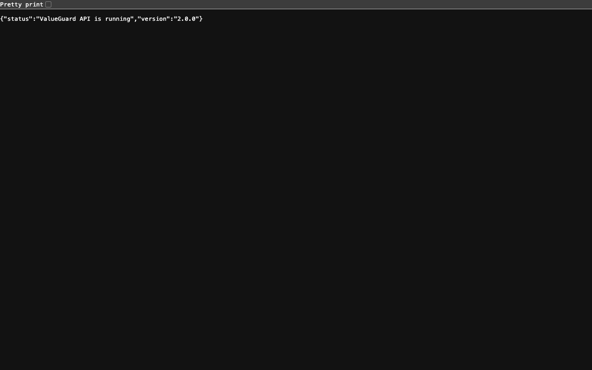

# ValueGuard — Real Estate Fair Value Detection Tool

> A full-stack financial intelligence tool that compares **Government Circle Rates** against **Estimated Market Rates** to flag overpriced or speculative properties in Indian tech hub cities.

---

## What It Does

ValueGuard is a property valuation dashboard for 6 Indian cities — Bengaluru, Hyderabad, Gurugram, Noida, Pune, and more. It:

- Pulls government-registered circle rates for 15 tech corridor zones
- Applies a multi-factor formula to estimate real market value
- Flags speculative pricing with **Safe / Caution / High Risk** risk levels
- Shows an animated variance gauge, live Chart.js comparison, city heatmap, and query history
- Exports results to CSV and print-friendly report

---

## Valuation Formula (Plain English)

The estimated market value per square foot is computed in four steps:

**Step 1 — Base Value**
Start with the government circle rate and multiply by a zone-specific growth multiplier that reflects infrastructure development:
```
Base = Circle Rate × Zone Multiplier
```

**Step 2 — Metro Premium**
If the property is near a metro station, add a proximity premium:
- Within 2 km → +₹800/sqft (high walkability premium)
- Within 5 km → +₹400/sqft (moderate connectivity premium)
- Beyond 5 km → ₹0 (no metro benefit)

**Step 3 — Age Depreciation**
Older properties lose value due to wear, obsolescence, and renovation costs:
```
Depreciation = Property Age (years) × ₹120/sqft/year
```

**Step 4 — Speculative Uplift**
Markets with active broker speculation or investor flipping activity inflate prices beyond fundamentals:
```
Speculative Uplift = Speculation Level (1–5) × ₹500/sqft
```

**Final Formula:**
```
Market Value = Base + Metro Premium − Age Depreciation + Speculative Uplift

Variance % = ((Market Value − Circle Rate) / Circle Rate) × 100

Risk:  < 20% → Safe | 20–50% → Caution | > 50% → High Risk
```

---

## Tech Stack

| Layer | Technology |
|---|---|
| Frontend | HTML5, CSS3, Vanilla JavaScript |
| Backend | Node.js, Express.js |
| Charts | Chart.js 4 (CDN) |
| Data | `backend/data.json` (15 locations) |
| Config | dotenv, CORS |

---

## Project Structure

```
value-guard/
├── backend/
│   ├── server.js           ← Express entry point
│   ├── routes/
│   │   └── valuate.js      ← API routes + valuation logic
│   ├── data.json           ← 15 Indian tech hub zones
│   └── .env                ← PORT=3000
├── frontend/
│   ├── index.html          ← Single-page dashboard
│   ├── style.css           ← Dark terminal design system
│   ├── print.css           ← Print-friendly layout
│   └── script.js           ← All JS (JSDoc'd, no frameworks)
└── README.md
```

---

## Setup & Run

### Prerequisites
- Node.js v18+
- npm

### 1. Install dependencies
```bash
npm install
```

### 2. Start the backend server
```bash
node backend/server.js
```
Server starts at `http://localhost:3000`. You should see:
```
ValueGuard running at http://localhost:3000
```

### 3. Open the frontend
Open `frontend/index.html` in your browser directly, or via live-server:
```bash
npx live-server frontend/
```

> No build step, no webpack, no bundler required.

---

## API Endpoints

| Method | Endpoint | Description |
|---|---|---|
| GET | `/api/locations` | Returns all 15 zone objects |
| POST | `/api/valuate` | Computes and returns valuation result |
| GET | `/api/history` | Returns last 5 session valuations |

### POST /api/valuate — Request Body
```json
{
  "location_id": "grg_cyber_city",
  "property_age": 8,
  "metro_distance_km": 1.5,
  "speculation_level": 4
}
```

### POST /api/valuate — Response
```json
{
  "zone_name": "Cyber City Gurugram",
  "city": "Gurugram",
  "circle_rate": 8500,
  "market_value": 17970,
  "variance_pct": 111.41,
  "risk_level": "High Risk",
  "reason_text": "High variance is driven by metro proximity and elevated broker speculation...",
  "breakdown": {
    "base": 15470,
    "metro_premium": 800,
    "age_depreciation": 960,
    "speculative_uplift": 2000
  },
  "timestamp": "2026-06-06T08:30:00.000Z"
}
```

---

## Features

- **Polished valuation dashboard UI** — light-first teal/blue palette, responsive cards, accessible controls
- **Live slider readouts** — property age, metro distance, speculation factor
- **Shimmer skeleton** — loading state during API fetch
- **Animated variance gauge** — CSS transition, color-coded green/amber/red
- **Chart.js comparison** — selected zone vs city average, updates on every result
- **City Heatmap tab** — all zones for selected city in a color-coded table
- **Query history drawer** — last 5 valuations, collapsible
- **Export CSV** — Blob download, no server needed
- **Print report** — `print.css` hides sidebar, shows clean layout
- **Graceful error handling** — inline banner, no layout break
- **ARIA attributes** — accessible labels, live regions, roles

---

## Screenshot

> _(Add screenshot here after first run)_



---

## Locations in Database

| Zone | City |
|---|---|
| Sector 62 Noida | Noida |
| Sector 18 Noida | Noida |
| Whitefield Bengaluru | Bengaluru |
| Electronic City Bengaluru | Bengaluru |
| Sarjapur Road Bengaluru | Bengaluru |
| Hinjewadi Pune | Pune |
| Magarpatta Pune | Pune |
| Gachibowli Hyderabad | Hyderabad |
| HITEC City Hyderabad | Hyderabad |
| OMR Chennai | Chennai |
| Sholinganallur Chennai | Chennai |
| Salt Lake Kolkata | Kolkata |
| New Town Kolkata | Kolkata |
| Cyber City Gurugram | Gurugram |
| Sohna Road Gurugram | Gurugram |

---

## License

MIT
